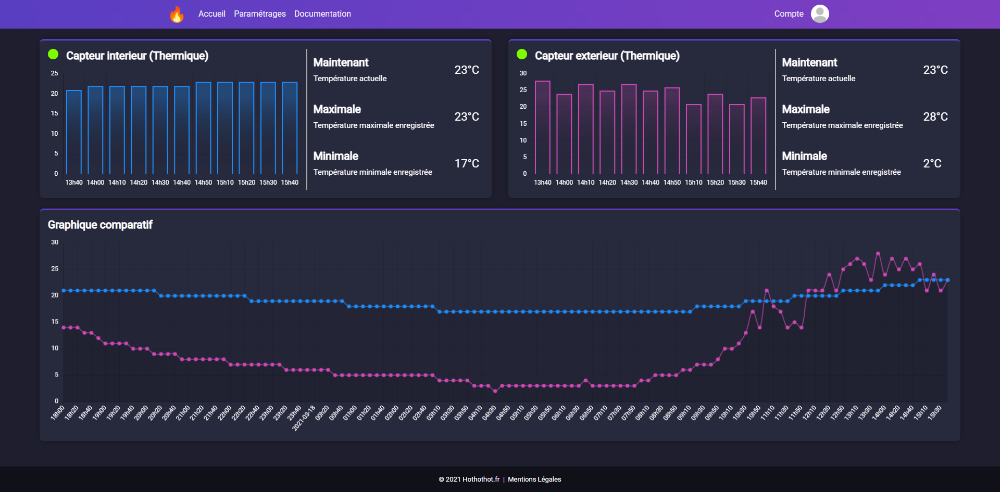

# [Hothothot](https://hothothot.minarox.fr/)
Création d'une interface d'information et de gestion d'un système domotique.

## Fonctionnalités
Voici la liste des fonctionnalités développées et mises en place sur le site web :

### Global
* Synchronisation et récupération automatique des informations des capteurs
* Valeurs actuelles, maximales et minimales enregistré par les capteurs
* Historique des valeurs des différents capteurs
* Comparaison des valeurs des différents capteurs
* Alertes personnalisables sur chaque capteur
* 100 % responsive design

### Comptes
* Inscription et connexion par adresse mail ou avec [Google](https://github.com/googleapis/google-api-php-client).
* Système de confirmation de compte et récupération du mot de passe avec envoie de mail
* Système anti-spam et anti-bot
* [CGU](https://hothothot.minarox.fr/cgu) et [Mentions légales](https://hothothot.minarox.fr/mentions-legales)
* Personnalisation, modification et suppression du compte
* Personnalisation de l'affichage des capteur par compte
* Personnalisation des alertes par capteur et par compte

### Autres
* Fichier de configuration modifiable
* Système de cache
* Exportation des données des capteurs
* Documentation
* Éditeur Wisiwig

## Dépendances
* [PHP 8.0](https://www.php.net/)
* [Google Lib](https://github.com/googleapis/google-api-php-client)
* [JBBCode](https://github.com/jbowens/jBBCode)
* [PHPseclib](https://github.com/phpseclib/phpseclib)
* [Crontab](https://www.linuxtricks.fr/wiki/cron-et-crontab-le-planificateur-de-taches)

## Installation
L'installation du site web est assez simple :

### Serveur web
Le serveur est compatible avec [Apache]() et [Nginx]().
Vous trouverez la configuration de ces 2 serveurs web dans le fichier [.htaccess](https://github.com/Minarox/hothothot/blob/main/.htaccess).

### Base de données
Il vous fait installer [MySQL](https://www.mysql.com/), créer un utilisateur dédié au site web, puis importer la [base de données](https://github.com/Minarox/hothothot/blob/main/Installation/hothothot.sql).  

### Crontab et SSH
Il vous faut également installer [Crontab](https://www.linuxtricks.fr/wiki/cron-et-crontab-le-planificateur-de-taches) (nécessaire pour la récupération automatique des données des capteurs) et posséder un accès SSH permettant le contrôler.
Nous vous conseillons fortement de créer un utilisateur exclusif au site web et ayant les droits d'exécuter crontab.

### Bibliothèques
Toutes les bibliothèques sont déjà pré-installées dans le dossier [Core/Classes/lib](https://github.com/Minarox/hothothot/tree/main/Core/Classes/lib).
Vous n'avez rien d'autres à faire de ce côté-là.

### Fichier de configuration
Le projet dispose d'un fichier de configuration servant d'exemple ici.
Vous devez le copier à la racine du projet et le renommer en "config.ini" pour que le site fonctionne.  

#### Configuration globale
    # Racine de votre site web vis-à-vis du Vhost de votre serveur web
    root_path = /

    # Mode de debug affichant les erreurs PHP
    debug = false

#### SSH
    # Information de connexion SSH
    ssh_host = localhost
    ssh_port = 22
    ssh_user = hothothot
    ssh_pass = hothothot

#### Base de données
    # Informations de connexion à la base de données MySQL
    db_type = mysql
    db_host = localhost
    db_name = hothothot
    db_user = hothothot
    db_pass = 'hothothot'

#### Capteurs
    # Temps entre chaque synchronisation (en minutes)
    sync_time = 5
    
    # Liens d'accès aux données des capteurs
    links = 'https://example.com/sensor1, https://example.com/sensor2'
    
    # Valeurs par défaut affiché sur la page d'accueil
    nb_default_values_sensors = 11
    nb_default_values_comparison = 128

#### Cookies
    # Temps d'innactivité avant la déconnexion automatique
    inactivity_time = 600
    
    # Temps avant l'invalidation du lien de récupération du mot de passe
    password_recovery_time = 600